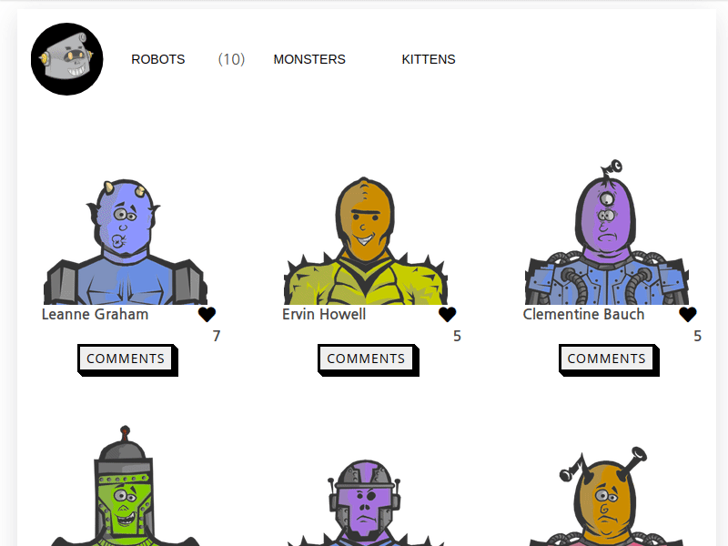

# JavaScript Capstone Project


> Capstone project for the JavaScript module from the Microverse curriculum



## Live Demo

[Live Demo Link](#/)

## Table of Contents

- [Description](##description)
- [Presentation](##presentation)
- [Built With](##built-with)
- [Getting Started](##getting-started)
  - [Prerequisites](#prerequisites)
  - [Setup](##setup)
- [Build Assets: Development](##build-assets-development)
  - [One time build assets for development](##one-time-build-assets-for-development)
  - [Build assets and enable source files watcher](##build-assets-and-enable-source-files-watcher)
  - [Start a development server - reloading automatically after each file change.](##start-a-development-server---reloading-automatically-after-each-file-change)
- [Build Assets: Production](##build-assets-production)
- [Authors](##authors)
- [Show Your Support](##how-your-support)
- [Acknowledgments](##acknowledgments)
- [License](##license)

## Description

The JavaScript capstone is a webapp that allows you to search for futuristic, cutting-edge technology robots that satisfy the need of your company. If you had a good user experience with our products, you can like an item. If you have further question, please comment on the robot of your choice.

## Presentation

[A brief presentation of the app](https://www.loom.com/share/3e50931611e742c788a80e69e5215abd)

## Built With

- [Webpack 5](https://github.com/webpack/webpack) - _JavaScript_ module bundler.
- [SASS](https://github.com/sass/sass) compiler based on Dart `sass`.
- [Babel 7](https://github.com/babel/babel) (`@babel/core`) - JavaScript compiler - _Use next generation JavaScript, today._

APIs used for this application:

- [Robohash API](https://robohash.org/)
- [jsonplaceholder API](https://jsonplaceholder.typicode.com/users)
- [Involvement API](https://www.notion.so/Involvement-API-869e60b5ad104603aa6db59e08150270)

## Getting Started

To get a local copy up and running follow these simple example steps.

### Prerequisites

- `node` : `^12 || >=14`
- `npm`

### Setup

1. Download or fork this project
2. Extract the release archive to a new directory, rename it to your project name and browse the directory.
3. Install all dependencies using:

```sh
npm install
```

Then you can start build assets for development or start a development server among other modes as described below:

## Build Assets: Development

### One time build assets for development

```sh
npm run build
```

### Build assets and enable source files watcher

```sh
npm run watch
```

### Start a development server - reloading automatically after each file change

```sh
npm run dev
```

## Build Assets: Production

Optimize assets for production by:

```sh
npm run production
```

## Authors

### John Arboleda

- GitHub: [@John-Arboleda](https://github.com/John-Arboleda)
- Twitter: [@John_J_Arboleda](https://twitter.com/John_J_Arboleda)
- LinkedIn: [@john-arboleda](https://www.linkedin.com/in/john-arboleda/)

### Fabricio Garcia

- GitHub: [@fabgrel10](https://github.com/fabgrel10)
- Twitter: [@fabgrel10](https://twitter.com/fabgrel10)
- LinkedIn: [@fabgrel10](https://www.linkedin.com/in/fabgrel10/)

## Show your support

Give a ⭐️ if you like this project!

## Acknowledgments

- This template is a simplified version of the [frontend-webpack-template](https://github.com/WeAreAthlon/frontend-webpack-boilerplate) by [Athlon](https://github.com/WeAreAthlon).

## License

This project is [MIT](./MIT.md) licensed.
